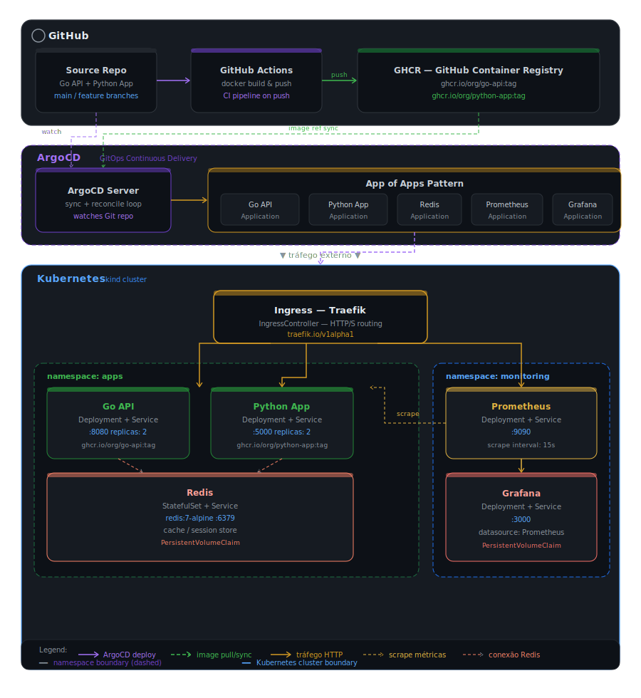

# INFRA LAB - GITOPS

Este repositório contém a configuração completa de um ambiente Kubernetes local utilizando:

* **kind** (Kubernetes in Docker)
* **Argo CD** (GitOps)
* **Traefik** (Ingress Controller)
* **Redis** (cache)
* **APIs em Go e Python**
  

O objetivo é simular um ambiente real de deploy utilizando GitOps, de forma simples e reproduzível.

---

## Arquitetura




```
kind cluster
│
├── Argo CD
│   └── Applications (GitOps)
│        ├── traefik
│        ├── redis
│        ├── go-api
│        └── python-api
│
├── Traefik (Ingress Controller)
│
├── Apps (namespace: apps)
│   ├── go-server-time-api
│   └── python-text-display-api
│
└── Redis (namespace: infra)
```

---

## Estrutura do repositório

```
.
├── argocd/
│   └── apps/
│       ├── root.yaml
│       ├── ingress.yaml
│       ├── redis.yaml
│       ├── go-api.yaml
│       └── python-api.yaml
│
├── helm/
│   └── charts/
│       ├── templates/
│       └── values.yaml
│   └── values/
│       
│
├── kind/
│   └── kind-config.yaml
│
├── scripts/
│   ├── bootstrap.sh
│   └── destroy.sh
│
└── README.md
```

---

##  Pré-requisitos

* Docker
* kubectl
* kind
* helm

O próprio `bootstrap.sh` instala automaticamente (exceto Docker).

---

## Subindo o ambiente

```bash
chmod +x scripts/bootstrap.sh
./scripts/bootstrap.sh
```

Esse comando:

* cria o cluster kind
* instala Argo CD
* aplica os Applications
* sobe Traefik, Redis e as APIs

---

## Destruindo o ambiente

```bash
chmod +x scripts/destroy.sh
./scripts/destroy.sh
```

---

## Acessando o Argo CD

```bash
kubectl port-forward svc/argocd-server -n argocd 8081:443
```

Acesse:

```
https://localhost:8081
```

Usuário:

```
admin
```

Senha:

```bash
kubectl -n argocd get secret argocd-initial-admin-secret \
-o jsonpath="{.data.password}" | base64 -d && echo
```

---

##  Acessando as aplicações

Use port-forward do Traefik:

```bash
kubectl port-forward svc/traefik -n traefik 19080:80
```

## Go API

```
http://go-server-time-api.127.0.0.1.nip.io:19080
```

## Python API

```
http://python-text-display-api.127.0.0.1.nip.io:19080
```

---

# Como funciona o GitOps aqui

* O Argo CD monitora este repositório
* Cada app é um `Application`
* Qualquer alteração no Git → deploy automático

## Fluxo:

1. CI gera imagem
2. CI atualiza `values/*.yaml`
3. Argo CD detecta mudança
4. Argo sincroniza automaticamente

---

# Padrão App of Apps

O arquivo:

```
argocd/apps/root.yaml
```

é responsável por gerenciar todos os outros apps.

Isso garante que:

* se um Application for deletado → ele volta
* o cluster sempre reflita o estado do Git

---

#  Build das imagens

As imagens são geradas via GitHub Actions usando:

* build multi-arch (amd64 + arm64)
* push para GHCR

Exemplo:

```
ghcr.io/<user>/go-server-time-api
ghcr.io/<user>/python-text-display-api
```

---

# Observações importantes

* O campo `ADDRESS` do Ingress pode ficar vazio em ambiente local (normal)
* O Argo CD pode mostrar `Progressing` mesmo com a app funcionando
* Em ambiente local foi utilizado `nip.io` para evitar `/etc/hosts`

---

# Troubleshooting

## App não responde

```bash
kubectl get pods -A
kubectl logs -n apps <pod>
```

## Testar service direto

```bash
kubectl port-forward svc/go-server-time-api -n apps 18080:80
curl http://127.0.0.1:18080
```

## Testar ingress

```bash
curl -H "Host: go-server-time-api.127.0.0.1.nip.io" http://127.0.0.1:19080
```

---

# Próximos passos

* TLS com Traefik
* autenticação no Argo CD
* multi-ambiente (dev/hml/prod)
* observabilidade (Prometheus/Grafana)

---

# Objetivo do projeto

Simular um ambiente real de deploy com:

* GitOps
* Kubernetes
* CI/CD
* Infra como código

Tudo rodando localmente 🚀